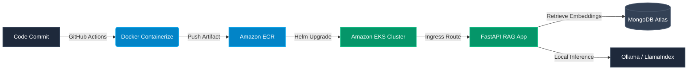

<!-- ========================================================= -->
<!--          PREMIUM DEVOPS & AI ARCHITECT README             -->
<!-- ========================================================= -->

<p align="center">
  
</p>

<h1 align="center">
  <a href="https://git.io/typing-svg">
    
  </a>
</h1>

<p align="center">
  <a href="https://github.com/Khuhsirox25">
    
  </a>
  <a href="https://github.com/Khuhsirox25?tab=followers">
    
  </a>
  <a href="https://github.com/Khuhsirox25?tab=repositories">
    
  </a>
  
</p>

<p align="center">
  
</p>

## 🌸 About Me

<table border="0">
  <tr>
    <td width="60%" valign="top">
      <p>🎓 <strong>B.Tech Computer Science Engineering</strong></p>
      <p>💻 Passionate about building and automating scalable, highly available systems powered by <strong>Cloud, DevOps, and AI.</strong></p>
      <p>🚀 I enjoy taking projects <strong>from idea ➜ development ➜ Docker ➜ Kubernetes ➜ AWS ➜ CI/CD</strong> instead of stopping after writing code.</p>
      <p><i>"I don't just build projects. I build systems that can scale."</i></p>
    </td>
    <td width="40%" align="right" valign="top">
      
    </td>
  </tr>
</table>

<br/>

### 🔄 Typical Deployment Lifecycle:


<p align="center">
  
</p>

## 🛠️ Cybernetic Tech Stack

<table width="100%">
  <tr>
    <td width="50%" valign="top">
      <h3>☁️ Cloud & Orchestration</h3>
      
      <ul>
        <li><strong>Infrastructure:</strong> AWS (EC2, S3, IAM, Route53, CloudFront)</li>
        <li><strong>Orchestration:</strong> Kubernetes, K3s, Helm Charts, Docker Compose</li>
      </ul>
    </td>
    <td width="50%" valign="top">
      <h3>⚙️ Automation & Pipeline</h3>
      
      <ul>
        <li><strong>IaC:</strong> Terraform (Modular Infrastructure provisioning)</li>
        <li><strong>CI/CD Pipelines:</strong> Multi-branch Jenkins, Declarative Actions</li>
      </ul>
    </td>
  </tr>
  <tr>
    <td width="50%" valign="top">
      <h3>🤖 Artificial Intelligence</h3>
      
      <ul>
        <li><strong>Large Language Models:</strong> RAG architectures, LlamaIndex, Ollama</li>
        <li><strong>ML Frameworks:</strong> PyTorch, TensorFlow, Scikit-Learn, Pandas</li>
      </ul>
    </td>
    <td width="50%" valign="top">
      <h3>💻 Core Development</h3>
      
      <ul>
        <li><strong>Backend:</strong> Python, Java, C++, FastAPI, Node.js</li>
        <li><strong>Databases:</strong> MongoDB Atlas, Firebase, MySQL</li>
      </ul>
    </td>
  </tr>
</table>

<p align="center">
  
</p>

## 🚀 Projects Showcase

<table width="100%">
  <!-- Project 1: CampusVibe -->
  <tr>
    <td width="35%" align="center" valign="middle">
      <br/><br/>
      
    </td>
    <td width="65%" valign="top">
      <h3>🧠 CampusVibe — AI Knowledge Assistant</h3>
      <p>An advanced Retrieval-Augmented Generation (RAG) platform that enables semantic search across university documentation using local LLMs.</p>
      <ul>
        <li><strong>Search Engine:</strong> LlamaIndex vector query pipelined into Ollama models.</li>
        <li><strong>API Interface:</strong> Backend built with FastAPI serving sub-second completions.</li>
        <li><strong>Orchestration:</strong> Dockerized microservices deployed into Kubernetes with automated replication configurations.</li>
      </ul>
      <p>
        
        
        
        
        
      </p>
    </td>
  </tr>
  
  <!-- Divider between projects -->
  <tr>
    <td colspan="2"></td>
  </tr>

  <!-- Project 2: Mental Health Predictor -->
  <tr>
    <td width="35%" align="center" valign="middle">
      <br/><br/>
      
    </td>
    <td width="65%" valign="top">
      <h3>😊 Mental Health Predictor</h3>
      <p>Interactive Machine Learning platform that predicts wellness and clinical anxiety severity using standardized PHQ-9 and GAD-7 metrics.</p>
      <ul>
        <li><strong>ML Engine:</strong> Custom pipelines built on Scikit-Learn utilizing classification trees.</li>
        <li><strong>Frontend Dashboard:</strong> Deployed interactively using Streamlit for clean data entry and dynamic charting.</li>
        <li><strong>Reporting:</strong> Auto-generates structured status reports for healthcare tracking.</li>
      </ul>
      <p>
        
        
        
        
      </p>
    </td>
  </tr>

  <!-- Divider between projects -->
  <tr>
    <td colspan="2"></td>
  </tr>

  <!-- Project 3: DevOps Portfolio -->
  <tr>
    <td width="35%" align="center" valign="middle">
      <br/><br/>
      
    </td>
    <td width="65%" valign="top">
      <h3>☸️ DevOps Portfolio — Production-Ready Infrastructure</h3>
      <p>Automated cloud infrastructure deployment pipeline utilizing IaC, Kubernetes, and CI/CD tools to deliver scalable application builds.</p>
      <ul>
        <li><strong>Infrastructure as Code:</strong> Fully parameterized Terraform scripts targeting AWS resource setups.</li>
        <li><strong>Automated Pipelines:</strong> Multi-stage CI/CD pipelines deploying builds upon testing verification stages.</li>
        <li><strong>Helm Configuration:</strong> Dynamic configurations controlling application manifests in Kubernetes clusters.</li>
      </ul>
      <p>
        
        
        
        
        
      </p>
    </td>
  </tr>
</table>

<p align="center">
  
</p>

## 📊 Live Metrics & Telemetry

<p align="center">
  
  
</p>

<p align="center">
  
</p>

### 🐍 Code Activity Matrix
<p align="center">
  
</p>

<p align="center">
  
</p>

## ☕ Beyond Coding

<table width="100%">
  <tr>
    <td align="center" width="33%">
      ☁️
      <h3>Cloud</h3>
      <p>Building scalable cloud-native architectures</p>
    </td>
    <td align="center" width="33%">
      🤖
      <h3>AI</h3>
      <p>Integrating local LLMs into production software</p>
    </td>
    <td align="center" width="33%">
      🚀
      <h3>DevOps</h3>
      <p>Automating infrastructure and deployment workflows</p>
    </td>
  </tr>
</table>

<br/>

<table border="0">
  <tr>
    <td width="40%" align="center" valign="middle">
      
    </td>
    <td width="60%" valign="top">
      <h3>💜 Things I Love</h3>
      <ul>
        <li>✨ Building advanced projects from scratch</li>
        <li>☕ Coffee + Chill Beats + Code</li>
        <li>🌸 Experimenting with state-of-the-art tech</li>
        <li>🐳 Containerizing everything with Docker</li>
        <li>☸️ Designing self-healing clusters in Kubernetes</li>
        <li>🌍 Open Source collaboration</li>
      </ul>
    </td>
  </tr>
</table>

<p align="center">
  
</p>

## 💡 Developer Diagnostics & Motivation

<table width="100%">
  <tr>
    <td width="50%" align="center" valign="middle">
      <h4>💻 Random Dev Quote</h4>
      
    </td>
    <td width="50%" align="center" valign="middle">
      <h4>😂 Developer Humor</h4>
      
    </td>
  </tr>
</table>

<br/>

> *"Small progress every single day becomes massive success one day."* 💜

<br/>

### ⚡ Systems Telemetry (Fun Facts)
- 🌸 I enjoy deploying applications much more than just writing the code.
- ⚡ I believe automation saves countless developer hours and eliminates human error.
- 🚀 My career focus is developing and scaling production-grade AI platforms.
- 🐳 Docker remains one of my absolute favorite developer tools.

<br/>

### 📌 Current Focus Matrix
```text
  ☁️ AWS Infrastructure Setup
  🐳 Microservices Dockerization
  ☸ Kubernetes Scheduling & Ingress
  ⚙ Declarative CI/CD Pipelines
  🤖 LLMs & Vector DB RAG Pipelines
```

<br/>

### 🧠 Runtime Philosophy
```python
class DevOpsLifeCycle:
    def __init__(self):
        self.systems_operational = True
        
    def execute_loop(self):
        while self.systems_operational:
            learn()
            design()
            build()
            test()
            dockerize()
            deploy()
            automate()
            monitor()
            optimize()
            # break_things() && fix_things()
```

<br/>

---

## 🎵 Currently Jamming To (Spotify)

<p align="center">
  
</p>

---

## 💌 Establish Connection

<p align="center">
  <a href="mailto:YOUR_EMAIL">
    
  </a>
  <a href="YOUR_LINKEDIN_URL">
    
  </a>
  <a href="https://github.com/Khuhsirox25">
    
  </a>
</p>

<p align="center">
  
</p>

<!-- ========================================================= -->
